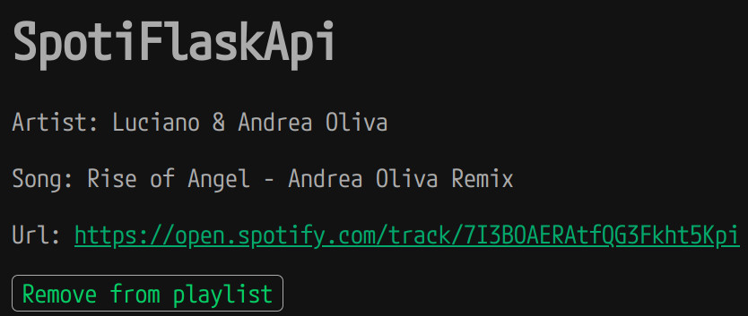

# SpotiflaskApi

This is a simple containerized python web application which uses flask module https://flask.palletsprojects.com/en/3.0.x/ and Docker, it allows you to get Spotify currently playing track, as well as adding or removing it from your playlist. It runs in your local machine at http://localhost:8888, access token and currently playing track is stored inside a redis server container.

- Check if currently playing track is already on your playlist or not.
- Add currently playing track to your playlist http://localhost:8888/current-track/add.
- Remove currently playing track to your playlist http://localhost:8888/current-track/remove.


## Prerequisites

* Python 3.11+
* Docker 25.0.2

## Running SpotiflaskApi

In order to execute it, you must have created a spotify developer app which will provide you the unique identifier of your app (Client ID) and the key you will use to authorize your Web API (Client Secret).

- Write your Client ID in spotify\_client\_id.txt file under spotiflaskapi-docker path.
- Write your Client Secret in spotify\_client\_secret.txt file under spotiflaskapi-docker path.
- Write Redirect URI in spotify\_uri.txt file under spotiflaskapi-docker path.

Execute the following commands:
```code
mkdir -p app/log
```

```code
docker compose up -d
```


